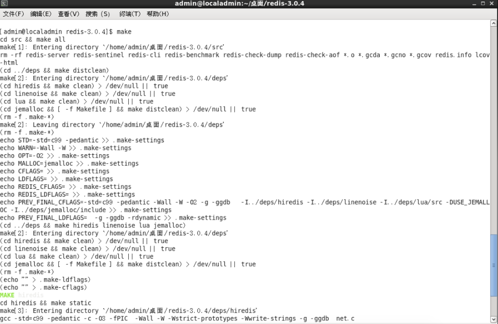

## Redis安装及基本使用[Linux版本]

### 安装Redis

首先从redis官网或github上下载redis的安装压缩包。

目前最新版:`redis-4.0.10`

复制安装包至Linux系统中。解压缩redis压缩包:

`tar -zxvf redis-4.0.10.tar.gz`

解压完毕后，进入解压出来的文件夹，通过命令:`make` 安装redis。

此处有坑:

使用`make`需要linux系统上装有`gcc`[一个C编译工具]
如果没有安装`gcc`,此时使用`make`命令会出现如下错误提示:



**`注意: 当make命令执行后，系统会残留部分信息在系统中。如果想再次使用make命令最后清理下。命令如下: make distclean`**

此时提示需要安装`gcc`工具。

安装gcc有两种方式:

- 用yum软件包管理器安装:
> sudo yum install gcc-c++


- 通过centOS的DVD2中提供的的安装包安装[需要通过rpm命令安装如下安装包]:
>  rpm -ivh ppl-0.10.2-11.el6.x86_64.rpm                                
> rpm -ivh cloog-ppl-0.15.7-1.2.el6.x86_64.rpm                      
> rpm -ivh mpfr-2.4.1-6.el6.x86_64.rpm                                  
> rpm -ivh cpp-4.4.7-17.el6.x86_64.rpm                                  
> rpm -ivh kernel-headers-2.6.32-642.el6.x86_64.rpm              
> rpm -ivh glibc-headers-2.12-1.192.el6.x86_64.rpm                
> rpm -ivh glibc-devel-2.12-1.192.el6.x86_64.rpm                    
> rpm -ivh libgomp-4.4.7-17.el6.x86_64.rpm                           
> rpm -ivh gcc-4.4.7-17.el6.x86_64.rpm    


gcc安装完毕后，再次进入redis安装目录，然后`make`命令[如果gcc安装之前已经执行make命令过，那么需要先清理点make失败后的残留文件,要执行`make distclean`命令]

执行make命令后，稍等一会儿安装过程。最后完成时会提示:

`Hint: It's a good idea to run 'make test' ;)`

**建议不要去按提示执行`make test`命令。因为该命令需要安装一个`tcl`工具。**

安装完成后，用管理员账号执行一次`make install`。提示:

```
	....
	INSTALL
	INSTALL
	INSTALL
	....
```

表示安装成功。


### 测试Redis之Hello World

**`首先: 在linux下usr目录类似于Windows系统下的program files目录`**

安装完成后，此时在 `usr/local/bin`目录下有一堆redis相关的命令。

为了以防万一，事先查看redis现在是否有在运行。通过命令:`ps -ef|grep redis`。
一般情况，刚刚安装完毕后redis是不会自动运行的，此时需要我们手动配置且测试运行。

- 在redis安装包下，有一个文件: `redis.conf`。该文件即为redis运行时需要用到的配置文件。我们在根目录下用管理员账号创建一个文件夹[命令:`mkdir 文件夹名`],然后拷贝该配置文件到该目录下[命令: `cp redis.conf /目标文件夹名/文件名`].注意，根目录下需要超级管理员权限才能创建和复制等操作。

- 然后我们用vim编辑器[命令: `sudo vim redis.conf`]打开该配置文件，找到如下一行:

```xml
# By default Redis does not run as a daemon. Use 'yes' if you need it.
# Note that Redis will write a pid file in /var/run/redis.pid when daemonized.
daemonize yes
```
将daemonize一行改为yes [默认为`no`]。然后保存退出。[注意，此时该文件所有权为root，需要超级管理员权限打开]

- 启动redis服务:在`usr/local/bin` 目录键入:`redis-server 刚刚拷贝的配置文件路径+文件名[/myredis/redis.conf]`，启动服务。 

- 通过`redis-cli -p 6379`连接`redis`数据库。此时注意到命令行出现变化:

```
[admin@localadmin bin]$ redis-server /myredis/redis.conf 
[admin@localadmin bin]$ redis-cli -p 6379
127.0.0.1:6379> 
```

- 测试redis是否真的连接,通过redis的命令: `ping`，此时如果返回`PONG`，则表示连接成功。

```
127.0.0.1:6379> ping
PONG
```

- 测试redis的操作: redis数据库的操作通过kv键值对来进行常规操作。测试命令和返回结果如下如下:

```
127.0.0.1:6379> set k1 hello
OK
127.0.0.1:6379> get k1
"hello"
```

**`reids安装与测试成功。`**

关闭redis命令:

```
SHUTDOWN
```
注意: 可能会出现`ERROR`

首先可以修改`redis.conf`下的`logfile`的路径改为自定义的路径加文件名。该属性指定日志的位置及名称。
在出现错误时可以到该指定的文件中查看出错的详细信息。

然后修改配置文件中`dir`属性，默认为当前路径[也就是配置文件所在路径。] 改为自己定义的路径[注意权限问题]，我第问题就是权限问题导致。

修改后保存。重启系统，按照之前方法重新登录测试后运行`SHUTDOWN`命令，此时错误排除。

`注意点: redis关闭前会将内存中的数据写入到磁盘中，如果权限不够则没法关闭也就是shutdown。所以才会出现我之前error的情况。`

> 当redis连接着时，可以通过redis自带的`redis-benchmark`命令测试reids的性能。